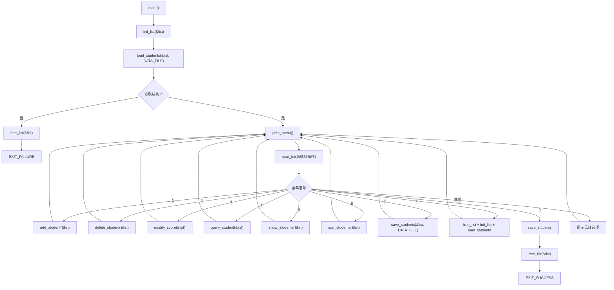
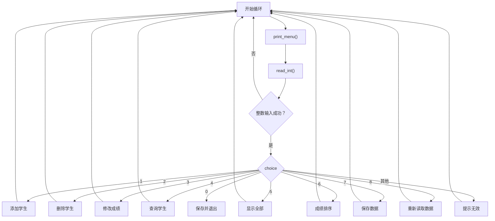
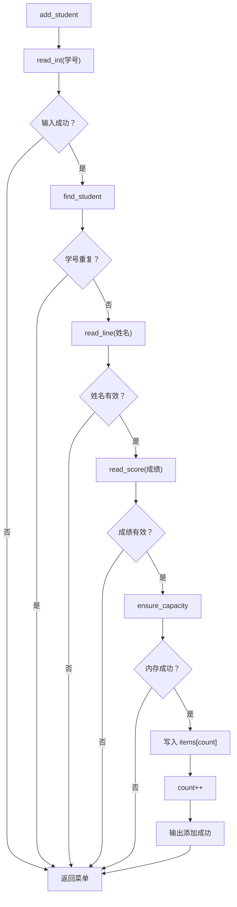
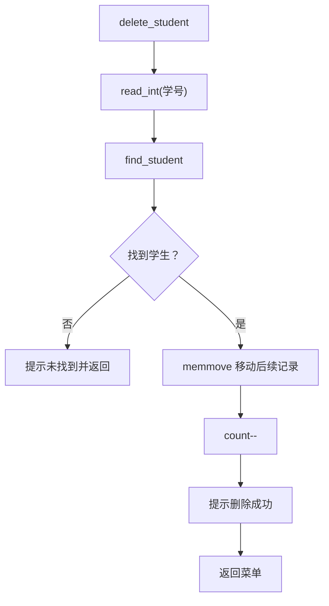
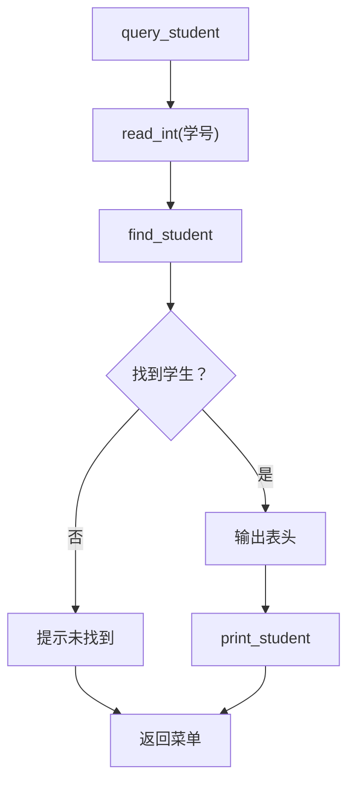
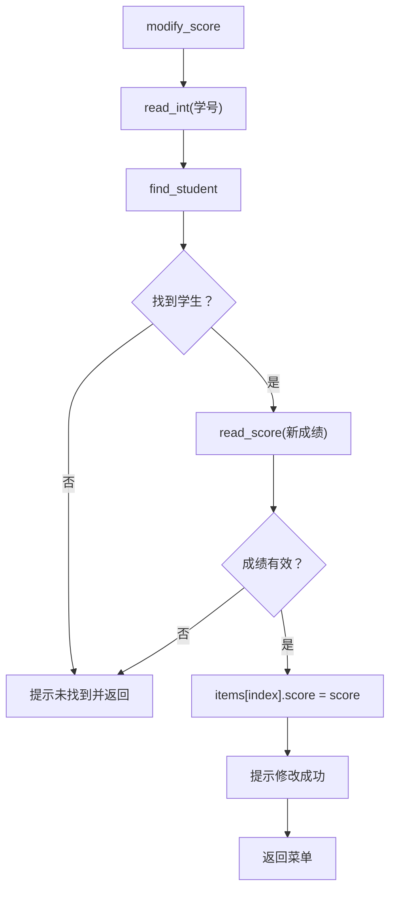
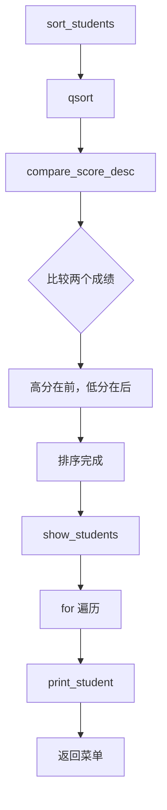
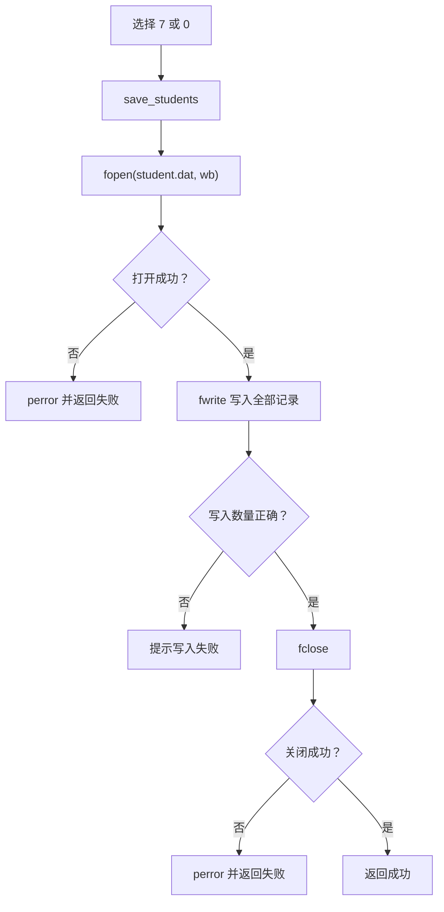
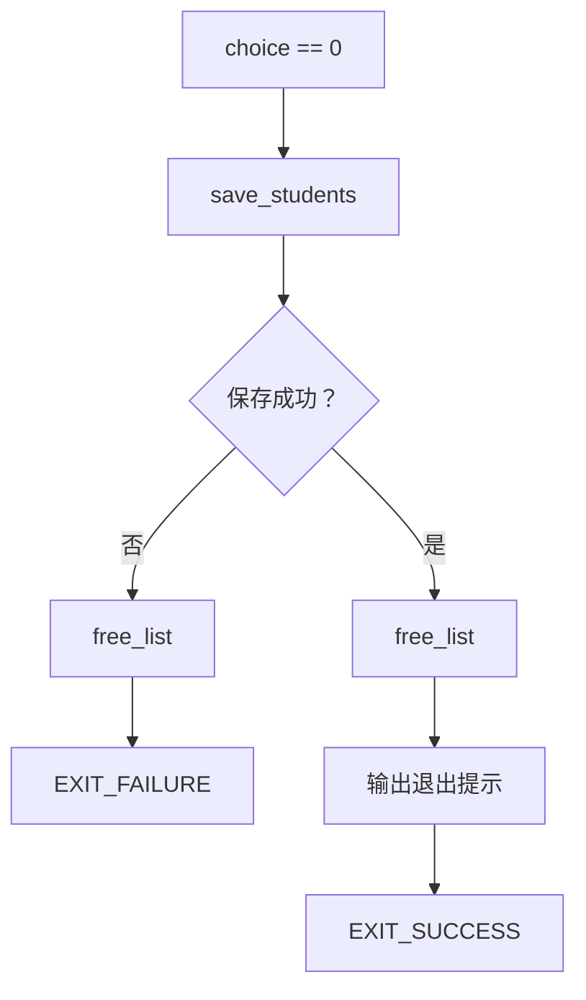

# 按函数调用顺序讲解程序运行过程（执行流程图版）

## 1. 总体调用关系



## 2. 程序启动阶段

1. 操作系统调用 `main()`。
2. `main` 声明 `StudentList list`。
3. 调用 `init_list(&list)`：
   - `items = NULL`
   - `count = 0`
   - `capacity = 0`
4. 调用 `load_students(&list, "student.dat")`。
5. `load_students` 调用 `fopen`：
   - 如果文件不存在，返回成功，表示首次运行；
   - 如果文件存在，循环调用 `fread`。
6. 每读取一个学生，就调用 `ensure_capacity`：
   - 第一次扩容到 8 个元素；
   - 容量不足时扩大为原来的 2 倍。
7. 文件读取结束后关闭文件，返回 `main`。
8. `main` 输出当前记录数，进入菜单循环。

## 3. 菜单循环流程



## 4. 添加学生的调用顺序



### 添加过程说明

`main` 选择 1 后调用 `add_student`。该函数依次调用 `read_int`、`find_student`、`read_line`、`read_score` 和 `ensure_capacity`。所有输入和内存检查通过后，才把局部变量 `student` 复制到动态数组末尾。

## 5. 删除学生的调用顺序



删除不会重新分配数组，而是把目标元素后面的记录整体前移，最后将 `count` 减一。

## 6. 查询学生的调用顺序



`query_student` 只读取和显示数据，不改变列表内容。

## 7. 修改成绩的调用顺序



## 8. 排序的调用顺序



`qsort` 在排序过程中多次回调 `compare_score_desc`。比较函数返回负数、0 或正数，分别表示排序先后关系。

## 9. 保存数据的调用顺序



选择 7 保存成功后继续显示菜单。选择 0 保存成功后还会继续调用 `free_list`，最后正常退出。

## 10. 重新读取数据的调用顺序

1. `main` 选择 8。
2. 调用 `free_list(&list)` 释放原数组。
3. 调用 `init_list(&list)` 恢复空列表状态。
4. 调用 `load_students(&list, DATA_FILE)` 重新读取 `student.dat`。
5. 每条记录通过 `ensure_capacity` 放入动态数组。
6. 输出读取结果并返回菜单。

## 11. 退出流程



退出时先保存数据，再释放动态内存。这样可以保证程序结束后不会遗留动态内存，也不会丢失学生信息。

## 12. 一次完整示例的调用链

假设用户依次输入“1、1001、张三、88.5、7、0”，调用顺序如下：

```text
main
 ├─ init_list
 ├─ load_students
 ├─ print_menu
 ├─ read_int                 // 读取 1
 ├─ add_student
 │   ├─ read_int             // 读取 1001
 │   ├─ find_student
 │   ├─ read_line            // 读取 张三
 │   ├─ read_score           // 读取 88.5
 │   ├─ ensure_capacity
 │   └─ 写入数组
 ├─ print_menu
 ├─ read_int                 // 读取 7
 ├─ save_students
 │   ├─ fopen
 │   ├─ fwrite
 │   └─ fclose
 ├─ print_menu
 ├─ read_int                 // 读取 0
 ├─ save_students
 ├─ free_list
 │   └─ free
 └─ EXIT_SUCCESS
```

这条调用链体现了程序的核心结构：`main` 负责流程控制，业务函数负责具体操作，输入函数负责数据校验，文件函数负责持久化，列表函数负责动态内存管理。
